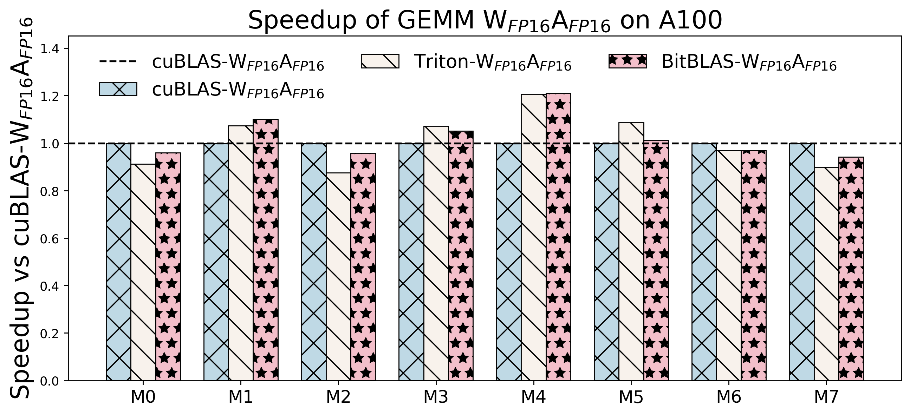
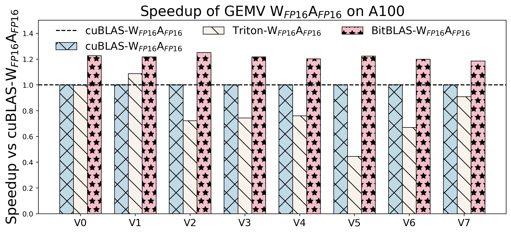
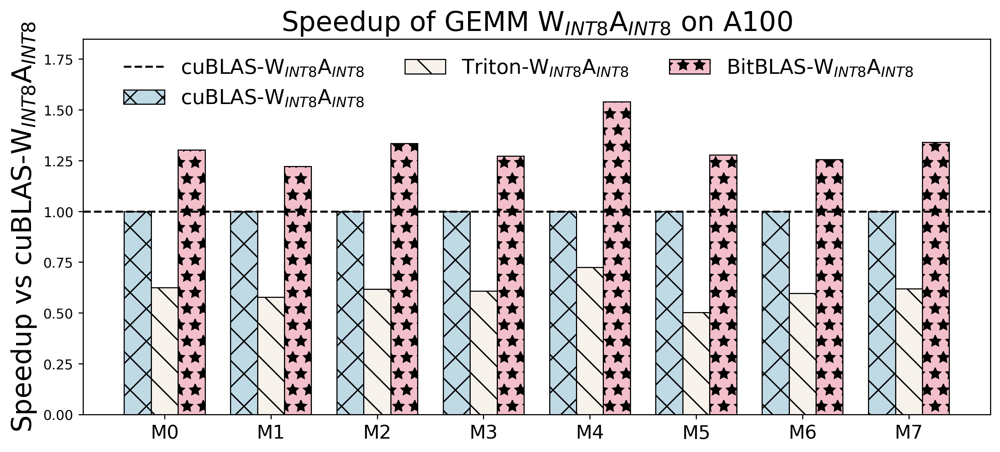
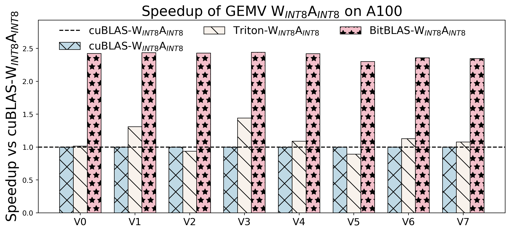
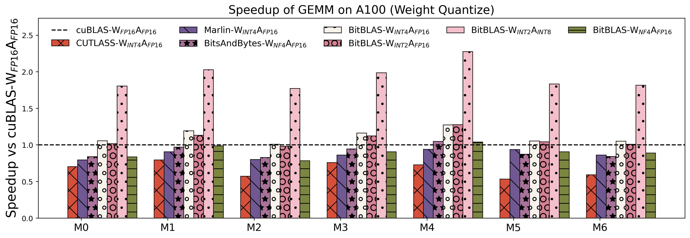
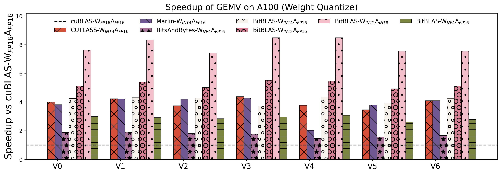
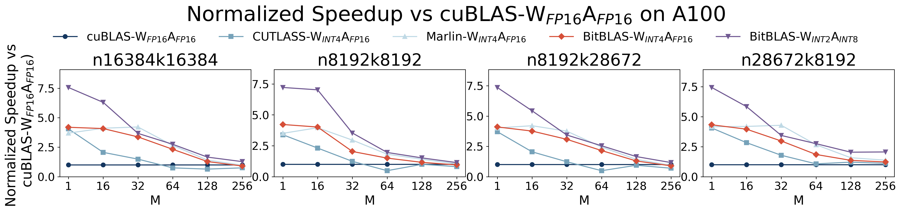

# BitBLAS-Benchmark

We evaluate the following categories of operations:
1.	FP16 Matrix Operations
    - GEMM (Matrix Multiplication)
    - GEMV (Matrix-Vector Multiplication)
2. INT8 Matrix Operations
    - GEMM (Matrix Multiplication)
    - GEMV (Matrix-Vector Multiplication)
3.	Dequantization Operations
    - Weight Quantization (WQ) GEMM and GEMV
4. Contiguous batching performance for enhanced GPU utilization

### FP16 GEMM and GEMV

2. INT8 GEMM and GEMV

### Dequantize GEMM and GEMV

### Contiguous Batching Performance

## Benchmark Configuration

The benchmark configurations for each test scenario are detailed below:

<!-- center -->

<table class="tableizer-table">
<thead><tr class="tableizer-firstrow"><th>config</th><th>Provider</th><th>M</th><th>N</th><th>K</th></tr></thead><tbody>
 <tr><td>V0</td><td>None</td><td>1</td><td>16384</td><td>16384</td></tr>
 <tr><td>V1</td><td>BLOOM</td><td>1</td><td>43008</td><td>14336</td></tr>
 <tr><td>V2</td><td>BLOOM</td><td>1</td><td>14336</td><td>14336</td></tr>
 <tr><td>V3</td><td>BLOOM</td><td>1</td><td>57344</td><td>14336</td></tr>
 <tr><td>V4</td><td>BLOOM</td><td>1</td><td>14336</td><td>57344</td></tr>
 <tr><td>V5</td><td>OPT</td><td>1</td><td>9216</td><td>9216</td></tr>
 <tr><td>V6</td><td>OPT</td><td>1</td><td>36864</td><td>9216</td></tr>
 <tr><td>V7</td><td>OPT</td><td>1</td><td>9216</td><td>36864</td></tr>
 <tr><td>V8</td><td>LLAMA</td><td>1</td><td>22016</td><td>8192</td></tr>
 <tr><td>V9</td><td>LLAMA</td><td>1</td><td>8192</td><td>22016</td></tr>
 <tr><td>V10</td><td>LLAMA-2</td><td>1</td><td>8192</td><td>8192</td></tr>
 <tr><td>V11</td><td>LLAMA-2</td><td>1</td><td>28672</td><td>8192</td></tr>
 <tr><td>V12</td><td>LLAMA-2</td><td>1</td><td>8192</td><td>28672</td></tr>
 <tr><td>M0</td><td>None</td><td>16384</td><td>16384</td><td>16384</td></tr>
 <tr><td>M1</td><td>BLOOM</td><td>8192</td><td>43008</td><td>14336</td></tr>
 <tr><td>M2</td><td>BLOOM</td><td>8192</td><td>14336</td><td>14336</td></tr>
 <tr><td>M3</td><td>BLOOM</td><td>8192</td><td>57344</td><td>14336</td></tr>
 <tr><td>M4</td><td>BLOOM</td><td>8192</td><td>14336</td><td>57344</td></tr>
 <tr><td>M5</td><td>OPT</td><td>8192</td><td>9216</td><td>9216</td></tr>
 <tr><td>M6</td><td>OPT</td><td>8192</td><td>36864</td><td>9216</td></tr>
 <tr><td>M7</td><td>OPT</td><td>8192</td><td>9216</td><td>36864</td></tr>
 <tr><td>M8</td><td>LLAMA</td><td>8192</td><td>22016</td><td>8192</td></tr>
 <tr><td>M9</td><td>LLAMA</td><td>8192</td><td>8192</td><td>22016</td></tr>
 <tr><td>M10</td><td>LLAMA-2</td><td>8192</td><td>8192</td><td>8192</td></tr>
 <tr><td>M11</td><td>LLAMA-2</td><td>8192</td><td>28672</td><td>8192</td></tr>
 <tr><td>M12</td><td>LLAMA-2</td><td>8192</td><td>8192</td><td>28672</td></tr>
</tbody></table>

